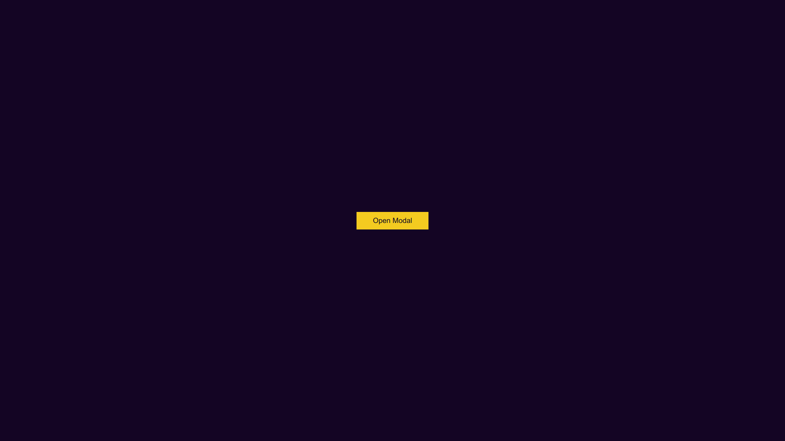

# Vue Custom Component With V-model (Modal/Dialog)

> This is a YouTube tutorial repo, in the tutorial, you will learn how to build custom component using v-model and you will build a modal/dialog

Live Demo: [Modal](https://vue3-modal.netlify.app/)

## Screenshots

> Delete the screenshot folder if you download this code




## Vue Version

Built with vue3 but can be applied to vue2

## Project setup

```
npm install
```

### Compiles and hot-reloads for development

```
npm run serve
```

### Compiles and minifies for production

```
npm run build
```

### Lints and fixes files

```
npm run lint
```

### Customize configuration

See [Configuration Reference](https://cli.vuejs.org/config/).

## License

This project is licensed under the MIT License

## Developed by Reagan Ekhameye (Tech Reagan)

Reach me on twitter [@techreagan](https://www.twitter.com/techreagan)
